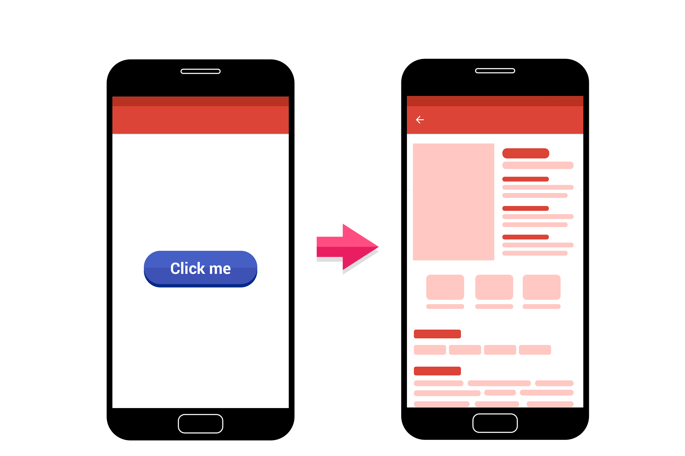

# Teori Intent

Intent adalah mekanisme untuk melakukan sebuah action dan komunikasi antar komponen aplikasi misal activity, services, dan broadcast receiver. Ada tiga penggunaan umum intent dalam aplikasi Android yaitu:

* Memindahkan satu activity ke activity lain dengan atau tidak membawa data.
* Menjalankan background service, misalnya melakukan sinkronisasi ke server dan menjalankan proses berulang (periodic/scheduler task).
* Mengirimkan obyek broadcast ke aplikasi yang membutuhkan. Misal, ketika aplikasi membutuhkan proses menjalankan sebuah background service setiap kali aplikasi selesai melakukan booting. Aplikasi harus bisa menerima obyek broadcast yang dikirimkan oleh sistem Android untuk event booting tersebut.

Intent memiliki dua bentuk yaitu:

### 1. Explicit Intent

Adalah tipe Intent yang digunakan untuk menjalankan komponen dari dalam sebuah aplikasi. Explicit intent bekerja dengan menggunakan nama kelas yang dituju misal `com.dicoding.activity.DetailActivity`. Umumnya intent ini digunakan untuk mengaktifkan komponen pada satu aplikasi.

Lalu mengapa disebut Explicit Intent? Hal ini karena tujuannya sudah jelas (explicit), misal dari MainActivity menuju ke DetailActivity. Tidak ada pilihan lain.



```java
<!-- Kotlin -->
val moveIntent = Intent(this@MainActivity, DetailActivity::class.java)
startActivity(moveIntent)

<!-- Java -->
Intent moveIntent = new Intent(MainActivity.this, DetailActivity.class);
startActivity(moveIntent);
```


### 2. Implicit Intent
Adalah tipe intent yang tidak memerlukan detail nama kelas yang ingin diaktifkan. Model ini memungkinkan komponen dari aplikasi lain bisa merespon request intent yang dijalankan.

Penggunaan tipe intent ini umumnya diperuntukan untuk menjalankan fitur/fungsi dari komponen aplikasi lain. Contohnya ketika kita membutuhkan fitur untuk mengambil foto. Daripada membuat sendiri fungsi kamera, lebih baik kita menyerahkan proses tersebut pada aplikasi kamera bawaan dari peranti atau aplikasi kamera lain yang telah terinstal sebelumnya di peranti.

Hal yang sama misalnya ketika kita membutuhkan fungsi berbagi konten. Kita bisa memanfaatkan intent untuk menampilkan aplikasi mana saja yang bisa menangani fitur tersebut.

Implementasi implicit intent ini akan sangat memudahkan bagi pengembang agar tetap fokus pada proses bisnis inti dari aplikasi yang dikembangkan.

Lalu mengapa disebut Implicit Intent? Hal ini karena tujuannya masih belum jelas (implicit), misalnya Anda ingin membuka gallery. Maka pilihannya yaitu Anda bisa menggunakan default gallery atau menggunakan Google Photos. Jika ada aplikasi lainnya yang bisa menangani aksi ini, maka aplikasi itu pun akan muncul.


Berikut adalah contoh kode dari gambaran Implicit Intent di atas:

```java
// Kotlin
const val SELECT_PICTURE = 1
 
val galleryIntent = Intent(Intent.ACTION_PICK)
galleryIntent.setType("image/*")
startActivityForResult(Intent.createChooser(galleryIntent, "Select Picture"), SELECT_PICTURE)

// Java
static final int SELECT_PICTURE = 1
 
Intent galleryIntent = new Intent(Intent.ACTION_PICK);
galleryIntent.setType("image/*");
startActivityForResult(Intent.createChooser(galleryIntent, "Select Picture"), SELECT_PICTURE);

```

Baca dan pahami materi pada link berikut ini: 

* [Developer Coaching : Navigasi Antar Halaman dengan Menggunakan Intent](https://youtu.be/i-HQJVlXFi8)
* [Intent](https://developer.android.com/reference/android/content/Intent.html)
* [Intent Filter](https://developer.android.com/guide/components/intents-filters.html)