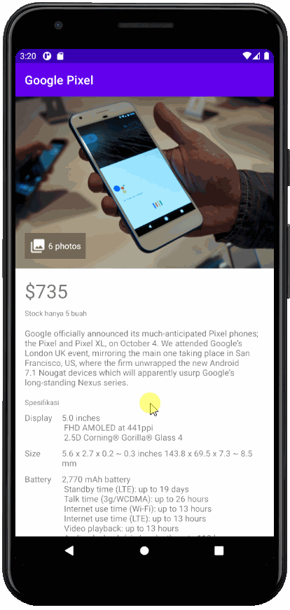

# Bedah Kode
Tidak ada yang rumit di bagian ini karena Anda hanya berhadapan dengan cara membentuk sebuah tampilan aplikasi Android yang bagus di berkas layout xml.

### CircleImageView
Di awal kita melakukan penambahan dependensi untuk menampilkan sebuah custom ImageView dalam bentuk lingkaran. Library yang digunakan adalah CircleImageView yang dibuat oleh Henning Dodenhoff. Library ini cukup populer dan selalu dikelola dengan baik.

### Strings.xml
Di sini kita akan menambahkan variabel-variabel konstan berupa String yang ditulis di dalam berkas strings.xml. Tujuannya agar teks yang sama tidak ditulis dua kali, baik itu di berkas Activity maupun berkas xml.

### View dan ViewGroup
Pembahasan mengenai Activity sebelumnya akan memudahkan Anda untuk memahami atribut dan namespace yang digunakan pada berkas layout xml. Anda dapat membaca kembali topik activity bila ada bagian yang Anda lupa.

Ingat, semua komponen view dan viewgroup memiliki dua buah atribut penting yang harus selalu diberikan nilai untuk mengatur posisi dirinya di dalam sebuat layout, yaitu:

* layout_width
* layout_height

Kita akan menggunakan sebuah obyek ScrollView yang akan menjadi root untuk tampilan halaman aplikasi. Kita menggunakan ScrollView sebagai root karena kita ingin halaman aplikasi bisa di-scroll ke bawah dan ke atas. Hal ini akan memudahkan pengguna untuk melihat tampilan secara menyeluruh.

Kita menggunakan `TableLayout` untuk menampilkan informasi spesifikasi dari perangkat Google Pixel. `TableLayout` yang kita gunakan sangatlah sederhana. Tidak ada garis pembatas untuk kolom dan baris bahkan cell-nya.
Hanya dengan menggunakan `TableRow` kita bisa menambahkan sebuah baris baru di dalam sebuah `TableLayout`. 

Selanjutnya, kita menggunakan sebuah `RelativeLayout` untuk menampilkan sebuah gambar dan teks. Posisi dari teks mengacu ke sebelah kanan dari image dan posisi keduanya disesuaikan untuk berada di tengah secara vertikal.

#### Noted!
```java
// Kotlin
supportActionBar?.title = "Google Pixel"

// Java
if (getSupportActionBar() != null) {
    getSupportActionBar().setTitle("Google Pixel");
}
```

Baris di atas akan mengganti nilai dari judul halaman pada `ActionBar` di dalam `MainActivity`. Kita menggunakan `getSupportActionBar()` karena kelas `MainActivity` inherit kepada `AppCompatActivity`, yang merupakan kelas turunan Activity. Kelas tersebut sudah menyediakan fasilitas komponen `ActionBar` dan mendukung semua versi OS Android.

Anda dapat mengunjungi tautan berikut untuk mendalami topik antar muka pada Android:
* [Resource UI dari Uplabs](https://www.uplabs.com/)
* [Material Design Uplabs](https://material.uplabs.com/)