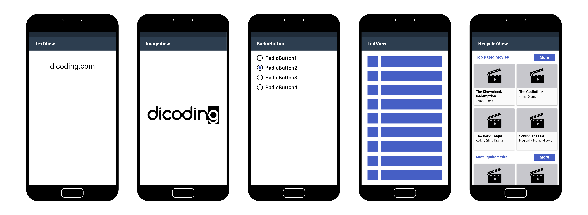
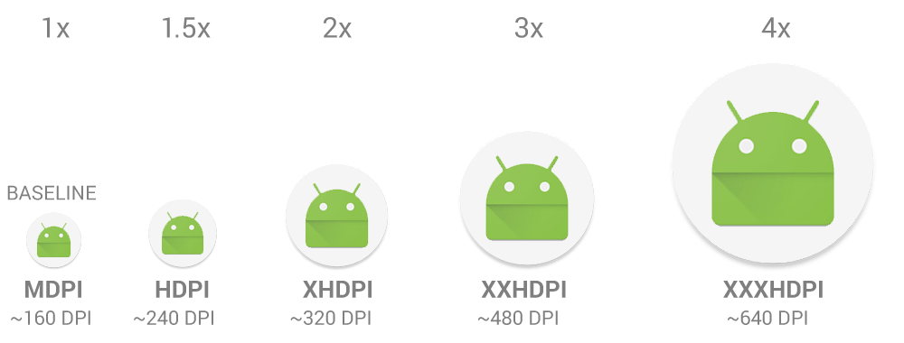
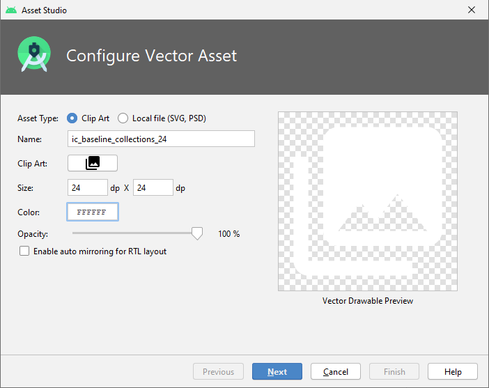

# Teori Views and Group
Pada dasarnya semua elemen antar pengguna di aplikasi Android dibangun menggunakan dua buah komponen inti, yaitu view dan viewgroup.

Sebuah view adalah obyek yang menggambar komponen tampilan ke layar yang mana pengguna dapat melihat dan berinteraksi langsung.

Contoh komponen turunan dari view seperti :

* **TextView**, komponen yang berguna untuk menampilkan teks ke layar.

* **Button**, komponen yang membuat pengguna dapat berinteraksi dengan cara ditekan untuk melakukan sesuatu.

* **ImageView**, Komponen untuk menampilkan gambar.

* **RecyclerView**, komponen untuk menampilkan informasi dalam bentuk list.

* **GridView**, komponen untuk menampilkan informasi dalam bentuk grid.

* **RadioButton**, komponen yang memungkinkan pengguna dapat memilih satu pilihan dari berbagai pilihan yang disediakan.

* **Checkbox**, komponen yang memungkinkan pengguna dapat memilih lebih dari satu dari pilihan yang ada.



Sedangkan viewgroup adalah sebuah obyek yang mewadahi obyek-obyek view dan viewgroup itu sendiri sehingga membentuk satu kesatuan tampilan aplikasi yang utuh. Contoh komponen viewgroup adalah:

* **LinearLayout**
* **FrameLayout**
* **RelativeLayout**
* **TableLayout**


Hierarki komponen view dan viewgroup dapat digambarkan dengan diagram berikut:


Inforamsi lebih lanjut: 
* [User Interface Overview](https://developer.android.com/guide/topics/ui/overview.html)

Salah satu contoh dari tampilan dalam file layout xml untuk merepresentasikan kolaborasi view dan viewgroup seperti ini :

```xml
<?xml version="1.0" encoding="utf-8"?>
<LinearLayout xmlns:android="http://schemas.android.com/apk/res/android"
              android:layout_width="match_parent"
              android:layout_height="match_parent"
              android:orientation="vertical" >
    <TextView android:id="@+id/text"
              android:layout_width="wrap_content"
              android:layout_height="wrap_content"
              android:text="I am a TextView" />
    <Button android:id="@+id/button"
            android:layout_width="wrap_content"
            android:layout_height="wrap_content"
            android:text="I am a Button" />
</LinearLayout>
```

Obyek turunan viewgroup `LinearLayout` menjadi kontainer untuk obyek turunan view, button, dan textview. Beberapa komponen viewgroup seperti *linearlayout*, *relativelayout*, *framelayout*, dan *tablelayout* merupakan komponen yang paling banyak digunakan untuk menjadi *parent/root* dari komponen-komponen view.

Berikut adalah definisi singkat dan inti dari komponen-komponen di atas terhadap penempatan komponen view (child) di dalamnya:

### LinearLayout
Akan menempatkan komponen-komponen di dalamnya secara horizontal atau vertikal. Linearlayout memiliki atribut weight untuk masing-masing child view yang berguna untuk menentukan porsi ukuran view dalam sebuah  ruang (space) yang tersedia.

  `android:orientation=”vertical”`
  `android:orientation=”horizontal”`

source : [Linier Layout](https://developer.android.com/guide/topics/ui/layout/linear.html)

### RelativeLayout
Layout yang lebih fleksible daripada layout yang sudah disebutkan di atas. Hal ini dikarenakan posisi dari masing-masing komponen di dalamnya dapat mengacu secara relatif pada komponen yang lainnya dan juga dapat mengacu secara relatif ke batas layar.

source : [Relative Layout](https://developer.android.com/guide/topics/ui/layout/relative.html)

### FrameLayout
*Layout ini adalah layout yang paling sederhana.* Layout ini akan membuat komponen yang ada di dalamnya menjadi menumpuk atau saling menutupi satu dengan yang lainnya.

Komponen yang paling pertama pada layout ini akan menjadi alas bagi komponen-komponen di atasnya. Framelayout memiliki kemampuan untuk menjadi kontainer untuk fragment-fragment di dalam sebuah activity. Berikut ilustrasi penggunaan framelayout terhadap child view yang dimilikinya:

source : [Frame Layout](http://developer.android.com/reference/android/widget/FrameLayout.html)

### Table Layout
Susunan komponen di dalam tablelayout akan berada dalam baris dan kolom. Namun layout jenis ini tidak akan menampilkan garis pembatas untuk baris, kolom atau cell-nya.

Source : [TableLayout](https://developer.android.com/guide/topics/ui/layout/grid.html)

Salah satu perbedaan mendasar dari keempat jenis layout di atas adalah **bagaimana komponen view di dalamnya tersusun.**

Kapan saatnya menggunakan linearlayout, relativelayout, framelayout dan tablelayout? Jawabannya **tergantung pada kebutuhan dan performa.**

Salah satu tips performa untuk aplikasi Android adalah dengan menyusun hierarki layout dalam sebuah file layout xml secara sederhana dan flat. Artinya, kita tidak membuat layout dengan jumlah kedalaman yang tinggi. Selain itu, penting juga bagi kita untuk memahami dasar pembangunan antarmuka, pengalaman pengguna ketika menggunakannya, dan selalu mencari pendekatan terbaik dalam penggunaan komponen antarmuka.

Semua tergantung latihan dan seberapa sering kita mengubah mockup menjadi tampilan sebenarnya, terutama dengan memaksimalkan penulisan kode antarmuka di berkas xml.

[Declaring Layout](https://developer.android.com/guide/topics/ui/declaring-layout.html)

### ScrollView
Adalah layout yang memungkinkan komponen di dalamnya digeser (scroll) secara vertikal dan horizontal. Komponen di dalam scrollview hanya diperbolehkan memiliki 1 parent utama dari linearlayout, relativelayout, framelayout, atau tablelayout.

* [ScrollView](https://developer.android.com/reference/android/widget/ScrollView.html)

### Satuan Dimensi di Android

Platform Android dikenal karena keberagamannya. Mulai ukuran perangkatnya, layar, spesifikasi, hingga level operating system-nya. Karena keberagaman tersebut, tak heran jika dibutuhkan tampilan yang konsisten agar aplikasi kita bisa berjalan dan tampil maksimal.

Android sendiri memiliki satuan unit dimensi untuk ukuran tinggi dan lebar sebuah komponen view atau viewgroup. Berikut adalah esensi dari satuan dimensi unit di android. 

1. Ekosistem Android dikenal dengan fragmentasi spesifikasi perangkat yang sangat bervariasi. Beragam perangkat Android memiliki perbedaan dimensi layar dan kerapatan pixel (density).

2. Untuk tampilan yang konsisten di perangkat Android, terdapat 2 jenis satuan, yaitu dip/dp (density-independent pixel) dan sp (scale-independent pixels).

3. Satuan dp/dip digunakan untuk satuan dari nilai dimensi misal width (attribut : layout_width) dan height (attribut : layout_height) dari sebuah komponen view atau viewgroup.

4. Satuan sp digunakan untuk ukuran teks. Perbedaannya dengan dp/dip adalah satuan sp android akan men-scale ukuran teks sesuai dengan setting ukuran teks di peranti (yang biasa dapat diakses melalui menu settings)


**Contoh 1 :**


Misalkan ada dua tablet 7-inch (ukuran diagonal layar). Tablet pertama (A) memiliki resolusi layar 1200x1920px 320dpi. Tablet kedua (B) memiliki resolusi 2048x1536px 326dpi.

Sebuah tombol berukuran 300x300px akan tampak normal pada tablet A. Tapi tombol tersebut akan terlihat terlalu kecil pada tablet B.

Tapi akan berbeda jika kita tentukan ukuran button-nya dengan ukuran yang bergantung pada density layar. Bila kita menggunakan ukuran 300x300dp, maka tombol tersebut akan terlihat baik pada beragam perangkat dengan ukuran yang berbeda.


Pada gambar di atas ukuran 200dp akan dikonversi pada device mdpi (device dengan density 160dpi/dots per inch) menjadi 200px dan menjadi 400px pada device xhdpi (density 420dpi) misal pada nexus 4. Sehingga ukuran tersebut tampak sama dan konsisten secara fisik untuk beragam peranti dengan ukuran layar yang berbeda.

#### Gambar untuk Semua Jenis Layar 

Supaya gambar pada aplikasi Anda tetap terlihat bagus pada semua jenis handphone dengan pixel yang berbeda-beda, maka Anda perlu menyiapkan gambar dengan berbagai versi untuk setiap jenis handphone, jika tidak maka gambar yang tampil akan terlihat kabur(blur).



Untuk menyiapkan gambar dengan format ini secara otomatis, Anda dapat memanfaatkan Image Asset Studio yang ada di dalam **Android Studio**. Caranya yaitu dengan `klik kanan pada folder res` dan pilih `New →  Image Asset. `


#### Vector Asset

Selain menggunakan gambar dengan format JPG, PNG, atau tipe bitmap lainnya, Android Studio juga dapat menerima gambar dengan tipe vector. Kelebihan dari penggunaan vector yaitu gambar tidak akan pecah walaupun diperbesar. Biasanya ia digunakan untuk icon di dalam aplikasi, bukan yang berupa fotografi.

Untuk menambahkan vector image caranya yaitu dengan `klik kanan pada folder res` dan `pilih New → Vector Asset.`



Anda bisa memilih beberapa icon yang sudah disediakan oleh Android Studio dengan memilih Clip Art, atau dengan menggunakan file sendiri yang bertipe SVG / PSD. Selain itu Anda juga bisa mengubah ukuran, warna, dan opacity icon tersebut. Setelah usai Anda dapat mencoba memperbesar gambar tersebut dan lihat hasilnya, gambar tidak akan pecah. Mantap!

Beberapa tautan berikut akan membantu Anda untuk lebih memahami bagaimana aplikasi Anda dapat mendukung beragam ukuran perangkat Android:

* Multiple Screen Support
* Screen Density
* DPI Screen
* DP/PX Converter
* Video Density-independent Pixels
* Density Pixal dan Scale Pixel


Pada modul berikutnya, kita akan menerapkan teori di atas. Sehingga Anda dapat memiliki pemahaman yang lebih baik mengenai teori tersebut.