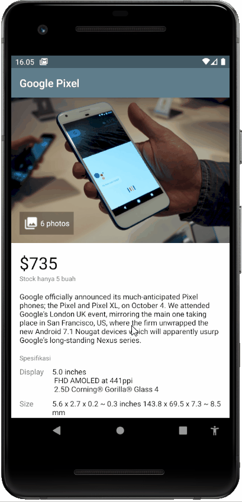
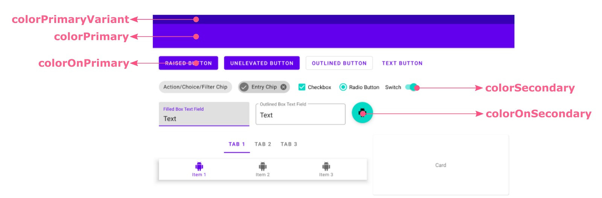

## Tujuan
Pada codelab kali kita akan menerapkan style dan theme pada contoh aplikasi yang telah kita buat sebelumnya pada modul Views dan Viewgroup. Beberapa poin yang didapatkan pada materi ini adalah:

1. Bagaimana memanfaatkan style pada aplikasi?
2. Bagaimana memanfaatkan theme pada aplikasi?
 
Hasil dari aplikasi yang dibuat akan jadi seperti ini:



# Bedah Kode

### Theme
Pada berkas themes.xml/styles.xml, terdapat tema default yang digunakan di project Anda, yaitu AppTheme yang kodenya seperti berikut:

```xml
<resources xmlns:tools="http://schemas.android.com/tools">
    <!-- Base application theme. -->
    <style name="Theme.MyViewAndViews" parent="Theme.MaterialComponents.DayNight.DarkActionBar">
        <!-- Primary brand color. -->
        <item name="colorPrimary">@color/gray</item>
        <item name="colorPrimaryVariant">@color/gray_dark</item>
        <item name="colorOnPrimary">@color/white</item>
        <!-- Secondary brand color. -->
        <item name="colorSecondary">@color/orange_light</item>
        <item name="colorSecondaryVariant">@color/orange_dark</item>
        <item name="colorOnSecondary">@color/black</item>
 
        <!-- Status bar color. -->
        <item name="android:statusBarColor" tools:targetApi="l">?attr/colorPrimaryVariant</item>
        <!-- Customize your theme here. -->
    </style>
    ...
</resources>
```

Berkas ini menentukan tema dari keseluruhan aplikasi. Dapat dilihat tema yang digunakan di sini yaitu Theme.MaterialComponents.DayNight.DarkActionBar yang merupakan tema Material Design Component dengan background putih dan action bar berwarna gelap. Beberapa atribut yang dapat dikustomisasi di dalamnya yaitu:

* colorPrimary : warna utama aplikasi yang tampil pada Action Bar dan komponen Button.
* colorPrimaryVariant : variasi dari warna utama yang biasanya digunakan pada Status Bar.
* colorOnPrimary : warna yang digunakan ketika ada text/icon di atas warna primary.
* colorSecondary : warna utama sekunder yang tampil pada Action Bar dan komponen EditText.
* colorSecondaryVariant : variasi dari warna sekunder.
* colorOnSecondary : warna yang digunakan ketika ada teks/icon di atas warna sekunder.
android:statusBarColor : warna yang digunakan untuk status bar.




### Style
Selesai! Saat ini Anda sudah memahami bagaimana Theme dan Style diterapkan dalam membangun sebuah aplikasi di Android. Pengelompokan atribut untuk view yang sama akan lebih memudahkan Anda dalam menentukan dan menyeragamkan format view yang akan ditampilkan ke dalam layar.

Contohnya lihat kode berikut:

```xml
<TextView
    style="@style/TextContent.Subtitle"
    android:layout_marginBottom="8dp"
    android:text="@string/seller" />
```

Anda bisa menyusun View menjadi lebih rapi dan cepat, ketika Anda memiliki komponen yang sama. Anda bisa memanggil style tersebut setiap halaman yang Anda butuhkan. 

Anda dapat mendalami lebih lanjut materi modul ini dengan membaca tautan berikut:

* [Developer Coaching : Membuat Tampilan Aplikasimu Semakin Menarik dengan Style & Theme](https://youtu.be/DNb6qnR_6FA)
* [Ui Theme](https://developer.android.com/guide/topics/ui/themes.html)
* [Material Design - Color System](https://material.io/design/color/the-color-system.html#color-theme-creation)