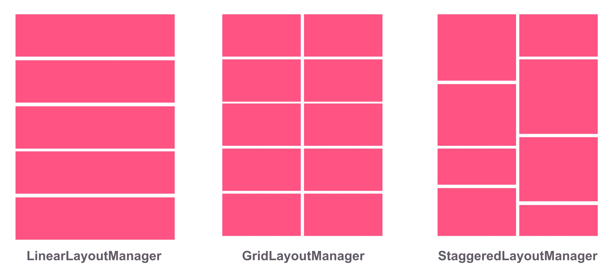

# TEORI

Sangat sederhana tapi sangat berarti. Mengapa? Pada dasarnya interaksi umum antara pengguna dengan aplikasi dalam menampilkan data dengan jumlah yang banyak adalah dengan menggunakan list yang bisa di-*scroll* ke atas dan ke bawah. Nah, untuk membuat list tersebut, Anda dapat menggunakan komponen RecyclerView.

RecyclerView adalah sebuah komponen tampilan (widget) yang lebih canggih ketimbang pendahulunya, yakni ListView. Gambar di bawah menunjukkan perbedaan ListView dan RecyclerView, jika Anda menggunakan ListView objek dari tiap item akan dibuat semuanya dari awal sampai akhir. Sedangkan jika Anda menggunakan RecyclerView, objek yang dibuat hanya sebatas ukuran layar dan beberapa di atas dan di bawahnya saja. Selanjutnya ia menggunakan kembali item yang sudah tidak terlihat. 

Apa dampaknya? Mungkin jika datanya sedikit tidak terasa, tetapi bagaimana jika datanya 1000? Tentu dengan menggunakan RecyclerView aplikasi akan menjadi lebih efisien dan tidak menghabiskan memori. 

Sebenarnya masalah pada ListView dapat diatasi dengan menggunakan ViewHolder pattern., namun penggunaannya belum diharuskan di ListView. Berbeda dengan RecyclerView yang mewajibkan menggunakan ViewHolder.

Selanjutnya lihatlah gambar penerapan RecyclerView berikut ini:

Gambar di atas menerangkan beberapa komponen yang harus Anda ketahui sebelum menggunakan recyclerview.

1. **RecyclerView dan LayoutManager**: Komponen antarmuka yang bertugas untuk menampilkan data set yang dimiliki di dalamnya. Layoutmanager akan mengatur posisi tampilan data baik itu secara list (vertikal), grid (baris dan kolom) atau staggered grid (grid yang memiliki susunan tak seragam / tak beraturan).

2. **Adapter**: Komponen yang akan mengatur bagaimana menampilkan data set ke dalam RecyclerView. Di sinilah terjadi proses pengisian tampilan (ViewInflate) dari file layout xml untuk tiap elemen dari data yang sebelumnya terpasang (bind) ke dalam RecyclerView.
3. **Dataset**: Kumpulan data yang dimiliki dan ingin ditampilkan. Bisa berupa array, list maupun obyek map.
4. **Item Animator**: Ini yang spesial. Kita bisa pasang animasi untuk tiap item di dalamnya. Contoh animasi yang umum seperti penambahan (add) dan penghapusan (removal) item. Kita akan mempelajari hal ini pada materi terpisah.

Langkah-langkah mengimplementasikan recyclerview sebagai berikut :

1. Tambahkan dependencies komponen recyclerview pada file build.gradle  level modul.

2. Tambahkan obyek RecyclerView di berkas layout xml dari activity / fragment.

3. Definisikan model kelas (POJO) yang akan digunakan sebagai data source.

4. Buat berkas layout xml untuk baris item di RecyclerView.

5. Buat sebuah kelas adapter yang inherit ke RecyclerView.Adapter dan ViewHolder untuk menampilkan tiap elemen data.

6. Definisikan obyek RecyclerView berikut dengan bentuk yang diinginkan (bisa dalam bentuk list, grid, atau staggered) dan selanjutnya pasang obyek adapter (binding) agar bisa menampilkan koleksi data ke dalam RecyclerView.